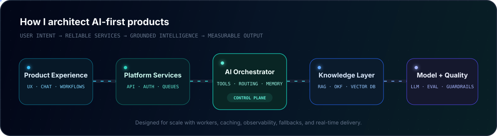

<div align="center">



[](https://git.io/typing-svg)

[](https://github.com/yashtech00)
[](https://github.com/yashtech00?tab=followers)
[](https://www.linkedin.com/in/yash00tech)

</div>

## `> whoami`

```yaml
name: Yash Gupta
role: Full-Stack Developer & Analyst
company: KPMG Advisory Services
location: Gurugram, India
identity: AI-first product engineer and systems builder
focus: [Applied AI, RAG, OKF, Chatbots, Distributed Architecture]
mission: Turn complex real-world problems into intelligent, scalable products
```

I’m a **Full-Stack Developer and Analyst** who builds AI-powered products from idea to production. Most of the systems I work on today use AI as a real product capability—not as a decorative feature added at the end.

My work combines **product thinking, full-stack engineering, AI orchestration, and heavy system architecture**. I enjoy taking an ambiguous problem, designing the complete technical flow, building the experience, connecting the intelligence layer, and making the final system reliable under real usage.

> **My engineering sweet spot:** products where web platforms, domain knowledge, AI models, queues, data pipelines, and real-time experiences must work together as one dependable system.

## What “building with AI” means in my work

| Capability | How I approach it |
|:---|:---|
| 🧠 **AI-first products** | I design AI into the core user journey, business rules, data flow, and feedback loop—not only into a chatbot window. |
| 📚 **RAG systems** | I work across ingestion, document processing, chunking, embeddings, retrieval, reranking, grounded generation, citations, and evaluation. |
| 🧩 **OKF integration** | I use structured knowledge and framework-driven logic to connect domain rules with intelligent retrieval and recommendations. |
| 💬 **Intelligent chatbots** | I build contextual assistants with memory, role-aware responses, tools, guardrails, fallbacks, and domain-specific knowledge. |
| 🔀 **AI orchestration** | I design multi-step workflows where models, databases, search, APIs, tools, and background workers collaborate reliably. |
| 🏗️ **System architecture** | I plan services, queues, caching, rate limits, failure handling, WebSockets, data contracts, observability, and deployment boundaries. |
| ⚡ **AI-assisted engineering** | I use AI throughout research, architecture, prototyping, implementation, testing, debugging, and documentation—while keeping engineering judgment in control. |

<div align="center">



</div>

## Systems I enjoy designing

- **Knowledge intelligence:** PDF and document ingestion, semantic search, vector databases, grounded answers, and framework comparison
- **AI evaluation:** structured scoring, quality checks, feedback generation, guardrails, and explainable recommendations
- **Real-time platforms:** live sessions, Socket.IO, Redis adapters, room-level events, and high-concurrency interactions
- **Background processing:** BullMQ workers, priority queues, retries, backpressure, scheduled jobs, and long-running AI workloads
- **Scalable backends:** authentication, role-based access, REST APIs, Prisma, PostgreSQL, MongoDB, Redis, and service boundaries
- **Production AI:** prompt versioning, token and latency control, caching, fallbacks, observability, rate limiting, and failure recovery
- **Human-centered products:** clear UX for complex workflows across education, skills, workforce, assessment, and employability

## My engineering loop

```text
01  Understand the real user and business problem
02  Map the end-to-end product and data flow
03  Design the architecture, boundaries, and failure paths
04  Build the experience, services, and AI orchestration
05  Ground responses with RAG, OKF, tools, and domain rules
06  Evaluate quality, latency, cost, safety, and reliability
07  Scale with workers, caching, observability, and automation
```

## Tech constellation

<div align="center">

### Languages

[](https://skillicons.dev)

### Product interfaces

[](https://skillicons.dev)

### Platforms and data

[](https://skillicons.dev)

### Cloud and engineering

[](https://skillicons.dev)

</div>

<details>
<summary><b>AI, architecture, and platform toolkit</b></summary>
<br>

`LLMs` · `RAG` · `OKF` · `LangChain` · `LangGraph` · `Vector Search` · `Prompt Engineering` · `AI Evaluation` · `Gemini` · `OpenAI` · `BullMQ` · `Socket.IO` · `Redis Pub/Sub` · `Prisma` · `Neon` · `Docker` · `React Native` · `Expo` · `Framer Motion`

</details>

## Current direction

```ts
const yash = {
  building: "AI-native products with strong engineering foundations",
  designing: "scalable architectures for data-heavy and real-time systems",
  exploring: ["agentic workflows", "AI evaluation", "developer tools", "open source"],
  improving: ["system design", "DSA in C++", "Python", "cloud-native engineering"],
  principle: "Useful AI needs reliable software around it."
};
```

## GitHub pulse

<div align="center">


</div>

## Contribution stream

<div align="center">

<picture>
  <source media="(prefers-color-scheme: dark)" srcset="https://raw.githubusercontent.com/yashtech00/yashtech00/output/github-contribution-grid-snake-dark.svg" />
  <source media="(prefers-color-scheme: light)" srcset="https://raw.githubusercontent.com/yashtech00/yashtech00/output/github-contribution-grid-snake.svg" />
  
</picture>

</div>

## Engineering philosophy

```text
Make the problem clear before making the solution clever.
Treat AI output as something to evaluate, not something to trust blindly.
Design failure paths before traffic finds them.
Automate repetition, observe production, and keep architecture understandable.
Build software that remains useful after the demo ends.
```

<div align="center">

### Let’s build something meaningful.

I’m always interested in AI products, scalable platforms, developer tools, open source, and technology with measurable real-world impact.

[](https://github.com/yashtech00)
[](https://www.linkedin.com/in/yash00tech)


</div>
